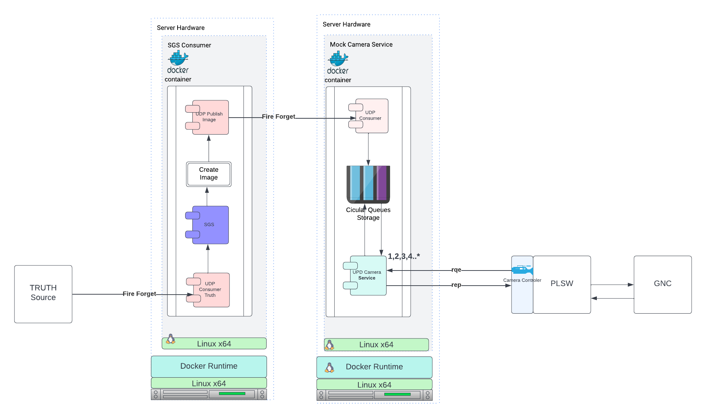
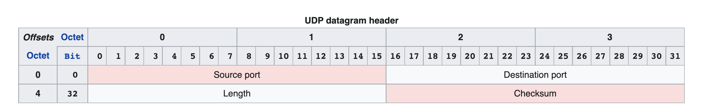
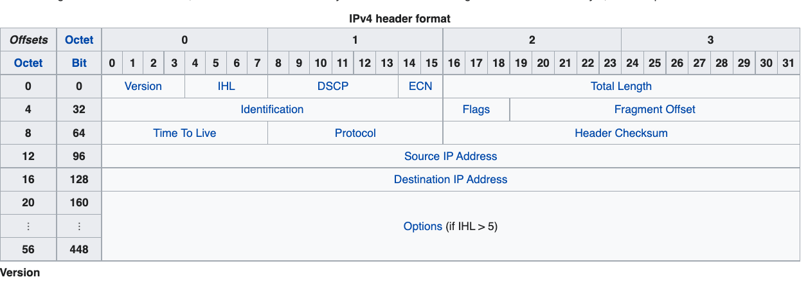

### Communication Library with UPD  

```
cmake .. -G"Visual Studio 16 2019" -DCMAKE_TOOLCHAIN_FILE=C:/Users/e438262/dev/github/vcpkg/scripts/buildsystems/vcpkg.cmake
```

#### This project provides a set of tools to allow integration between process and hosts. 

- We need to send a UDP message to (host,port)
  - (fire and forget mode)
- We need to consume UDP messages with reply in
  - (consume and process mode)
- We also need to provide a service as request reply 
  - (service mode)
- We will be sending plain old serialized structs over the wire:

For example following will work when all things are hte same. Normally Protocol Buffers
would be much more reliant but for reason beyond my control the below will surfice

```c++
    // TODO: maybe shared_ptr
    template <class SomeStruct>
    char*  Serialize(SomeStruct& s) {
        size_t size = sizeof(SomeStruct);
        char* p = (char*)&s;
        return p;
    }

    // TODO: maybe shared_ptr
    template <class SomeStruct>
    SomeStruct* DeSerialize( char* src) {
        size_t len = sizeof(SomeStruct);
        char* dest = new char[len];
        memcpy(dest, src, len);
        SomeStruct* s = (SomeStruct*)(dest);
        return s;
    }

    typedef struct example {
    uint8_t _u8;
    uint16_t _u16;
    uint32_t _u32;
    char matrix[100][200];
    } Test;

    TEST_CASE("Serializer Test ", "_1") {
        Test test;
        test._u8 = 1;
        test._u16 = 2;
        test._u32 = 3;
        char*   t = lm::spp::Serialize(test);
        Test* test2 = lm::spp::DeSerialize<Test>(t);
        REQUIRE(test._u8 == test2->_u8);
        REQUIRE(test._u16 == test2->_u16);
        REQUIRE(test._u32 == test2->_u32);
    }
```
What are we doing:
- What are adding a simulation by mocking out the camera system.
- The image mock will conform to the received instruction

Requirements:
- We will consume Truth Data "UDP Consume and Process Mode".
- We will consume serialized struct
- We will provide the mocked images through  "Udp Service Mode".
- Must perform better then 1HZ
- Must have flexibility in serialized struct 

Inferred Tasks
- We will consume truth message via UPD 
- We will forward truth data will need to be forward to our image generation system assumed SGS
- The message will be forwarded to SGS via "Fire and Forget mode" or Direct API call
- SGS 's constructed image is relay by "Fire and Forget mode" the to "Mock Service"
- The Mock Service will use "UDP Consume and Process Mode" to receive GSG images
- We will use docker
  - SGS 
  - Mock Image Service 

Environment
- linux x64
- docker/podman
- boost and boost asio
we will be mocking multiple cameras.

Notes:
- Images Gray Scale Images at 2592 x 1444
- Server queues image in CircularBuffer 
- Configurable depth N
- Image queries are by timestamp processed from above CircularBuffer
 
### RISKS

- The image is larger han the maximal allowed UPD payload

#### Application FLow

- consumer truth
- create image
- image sender
- image receiver
- persistence in memory circular queue
- image service


 

### UDP

UDP is connectionless: 
- Means make no efforts to validate delivery ... etc
---
Thus:
- Unreliable  – cannot be known if it will reach its destination
- Not ordered – cannot be guaranteed.
- Lightweight – as consequence 
- Datagrams –  the read operation at the receiver socket will yield an entire message as it was originally sent.
---
- Broadcasts – UDP can broadcast - sent packets can be addressed to be receivable by all devices on the subnet.
- Multicast – a multicast mode of operation is supported whereby a single datagram packet can be automatically routed without duplication to a group of subscribers.
---

- 

- Source port number
  - identifies the sender's port
  - assumed to be the port to reply to if needed. 
 - Destination port number 
   - identifies the receiver's port and is required. 
 - Length
   - specifies the length in bytes of the UDP header and UDP data. 
   - minimum length is 8 bytes, the length of the header. 
   - limit of 65,535 bytes (8-byte header + 65,527 bytes of data) for a UDP datagram.
   - However, the actual limit for the data length, which is imposed by the underlying IPv4 protocol, is 65,507 bytes (65,535 bytes − 8-byte UDP header − 20-byte IP header) 
- Checksum 
  - The checksum field may be used for error-checking of the header and data. 
  - optional in IPv4
  - mandatory in IPv6
  - The field carries all-zeros if unused 

<<<<<<< HEAD
### Regarding Size

The image alone
```
2591 * 1444 = 3,742, 848 bytes = 3.742848 MB = 0.003742848G
```


=======
For completeness IP4 header:

>>>>>>> a83417b72d6c194eeeec85299824606b930acdba

### Synchronous UDP Client 

- Acts as a client in the client-server communication model
- Communicates with the server application using UDP
- Uses I/O that block the thread
    - execution until the corresponding operation completes
    - or an error occurs

### Functionaly

- Given IP-address(s) and port(s) number 
- Allocate a UDP socket.
- Exchange messages with the servers.
- Deallocate the socket.


 # PGM
- The PGM format is a lowest common denominator grayscale file format.
- PGM image can just be thought of an array of arbitrary integers
- Characters from a "#" to the next end-of-line are ignored 

# PGMA ASCII PGM (Portable Gray Map)
```
        P2
        # feep.ascii.pgm
        24 7
        15
        0 0  0  0  0  0  0  0  0 0  0  0  0  0  0  0  0 0  0  0  0  0  0  0
        0 3  3  3  3  0  0  7  7 7  7  0  0 11 11 11 11 0  0 15 15 15 15  0
        0 3  0  0  0  0  0  7  0 0  0  0  0 11  0  0  0 0  0 15  0  0 15  0
        0 3  3  3  0  0  0  7  7 7  0  0  0 11 11 11  0 0  0 15 15 15 15  0
        0 3  0  0  0  0  0  7  0 0  0  0  0 11  0  0  0 0  0 15  0  0  0  0
        0 3  0  0  0  0  0  7  7 7  7  0  0 11 11 11 11 0  0 15  0  0  0  0
        0 0  0  0  0  0  0  0  0 0  0  0  0  0  0  0  0 0  0  0  0  0  0  0
```
- the typical file extension is ".pgm", but an extension of ".pnm" is also occasionally used.
- magic number for identifying the file type
- whitespace
- width formatted as ASCII characters in decimal.
- whitespace
- height again in ASCII decimal.
- max grey value again in ASCII decimal.
- single white space char usually new line
- raster rows of height in order top to botton
  - each in ASCII decimal
  - between 0 and the specified maximum value
  - separated by whitespace, 
  - starting at the top-left corner of the graymap
  - proceeding in normal English reading order

  # PGMB, a data directory which describes binary PGM (Portable Gray Map) files.
- the typical file extension is ".pgm", but an extension of ".pnm" is also occasionally used.
- A "magic number" for identifying the file type. A binary PGM file's magic number is the two characters "P5".
- Whitespace (blanks, TABs, CRs, LFs).
- A width, formatted as ASCII characters in decimal.
- Whitespace.
- A height, again in ASCII decimal.
- Whitespace.
- The maximum gray value, MAXVAL, again in ASCII decimal. MAXVAL must be between 0 and 255.
- A single character of whitespace, typically a newline;
- Width * height gray values, each stored as a plain byte, 
- between 0 and the specified maximum value, 
- separated by whitespace, 
- starting at the top-left corner of the graymap, 
- proceeding in normal English reading order. 
- A value of 0 means black, and the maximum value means white.
- Characters from a "#" to the next end-of-line are ignored (comments).

 